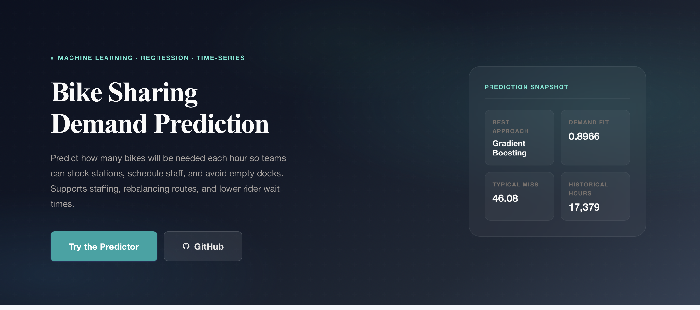
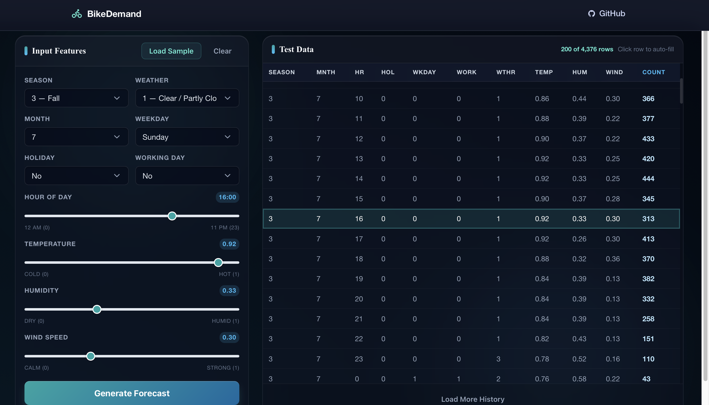
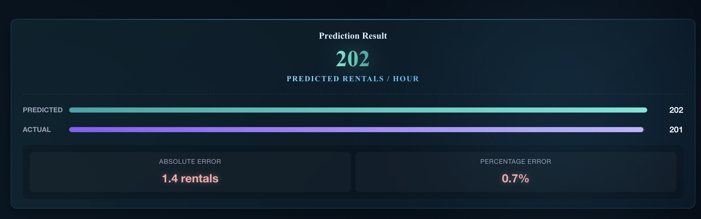

# Bike Sharing Demand Prediction

Predicts hourly bike rental demand to help operators optimize fleet allocation and resource planning.

## Live Website

Visit the live dashboard here: [https://bike-demand.example.com](https://bike-demand.example.com)



---

## Problem & Business Impact

Bike sharing operators face challenges balancing bike availability with demand fluctuations. Overestimating demand leads to idle assets; underestimating results in lost revenue and poor customer experience. This model forecasts hourly demand with **89.7% accuracy (R²)**, enabling data-driven inventory decisions that reduce shortages and improve operational efficiency.

## Dataset

- **Source**: Bike Sharing Dataset (Kaggle)
- **Size**: ~17,000 hourly records
- **Target Variable**: `cnt` (total rental bikes per hour)
- **Challenges**: Seasonality, weather sensitivity, imbalanced demand patterns (peak vs. off-peak hours)

## Modeling Approach

| Model | MAE | RMSE | R² |
|-------|-----|------|-----|
| Gradient Boosting | 46.08 | 70.65 | **0.897** |
| Random Forest | 50.25 | 76.77 | 0.878 |
| Decision Tree | 58.24 | 91.24 | 0.828 |
| Linear Regression | 108.64 | 144.19 | 0.569 |

**Final Model**: Gradient Boosting — selected for best balance of accuracy and generalization.

**Metric Justification**: R² measures variance explained; MAE provides interpretable error in bike counts; RMSE penalizes large deviations critical for peak-hour predictions.

## System Components

1. **Data Preprocessing** — Missing value handling, categorical encoding (season, weather, weekday)
2. **Feature Engineering** — Hour extraction, cyclical encoding, temperature-feel conversion
3. **Training Pipeline** — Train/test split, model comparison, artifact generation
4. **Inference API** — FastAPI endpoints for real-time predictions
5. **Dashboard UI** — Interactive web interface for predictions and model analysis
6. **Deployment** — Docker-ready, auto-retrains on startup if artifacts are missing

## Quick Start

```bash
# Clone and setup
git clone https://github.com/gitadminken/Bike-sharing.git
cd Bike-sharing

# Install dependencies
pip install -r requirements.txt

# Run locally
uvicorn app.main:app --reload

# Open browser
http://localhost:8000
```

### Docker

```bash
docker build -t bike-demand .
docker run -p 8000:8000 bike-demand
```

---

## How to Use

### 1. Dashboard

The interactive dashboard visualizes model performance, highlights key metrics, and compares prediction results across multiple algorithms, enabling users to explore data trends and evaluate forecasting accuracy.


### 2. Make a Prediction

Navigate to the prediction page. You can either:
- Manually input features (season, weather, holiday, working day, temperature, humidity, wind speed), or
- Click **"Load Random Test Data"** to auto-fill with sample data

Then click **Generate Forecast** to get the predicted bike count.




### 3. View Results

The model returns the predicted bike count along with actual values (if provided from test data) for comparison.




---

## Tech Stack

- **Backend**: FastAPI, Uvicorn
- **ML**: scikit-learn, XGBoost, pandas, NumPy
- **Frontend**: HTML, JavaScript, Jinja2
- **Deployment**: Docker

## Future Improvements

1. **Add time-series features** — Incorporate lag features and rolling averages for improved forecasting
2. **Deploy to cloud** — Kubernetes deployment with CI/CD pipeline
3. **Real-time data integration** — Connect to live weather API for dynamic predictions

---
Built with FastAPI + Gradient Boosting
